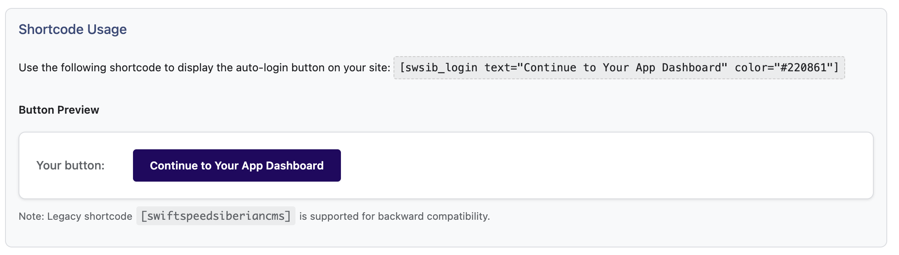

# 🚀 SiberianCMS Integration

<div align="center">

[](https://wordpress.org/)
[](https://php.net/)
[](http://www.gnu.org/licenses/gpl-2.0.txt)

**Seamless integration between WordPress and Siberian CMS**

[Features](#-key-features) • [Installation](#-installation) • [Configuration](#-configuration) • [Usage](#-usage) • [Pro Version](#-pro-version) • [Support](#-support)

</div>

---

## 📋 Overview

SwiftSpeed Siberian Integration creates a robust bridge between WordPress and [Siberian CMS](https://www.siberiancms.com/), delivering a frictionless experience for both administrators and users. Unlike outdated solutions that charged premium fees (119€+), we offer core functionality **completely free** while maintaining the highest standards of security and performance.

Our plugin strictly follows Siberian's official documentation and **never** compromises your Siberian installation's integrity or security modules.

### Why Choose SwiftSpeed Siberian Integration?

- **Security-First Approach**: Implements secure authentication practices without modifying Siberian core files
- **Modern Architecture**: Built with the latest WordPress development standards
- **Performance Optimized**: Minimal overhead and efficient database operations
- **Developer Friendly**: Extensible design with clear documentation
- **Actively Maintained**: Regular updates for compatibility and security

---

## 🔑 Key Features

### Free Version

<table>
  <tr>
    <td width="50%">
      <h4>📲 One-Click Auto Login</h4>
      <p>Generate secure auto-login links for WordPress users to access their Siberian dashboards instantly, improving user experience and reducing friction.</p>
    </td>
    <td width="50%">
      <h4>🔄 Password Synchronization</h4>
      <p>Keep WordPress and Siberian credentials in perfect harmony, allowing users to maintain a single set of login credentials across platforms.</p>
    </td>
  </tr>
  <tr>
    <td width="50%">
      <h4>🔌 API Integration</h4>
      <p>Leverage Siberian's official API for secure communication without any hacks or overrides to the Siberian core system.</p>
    </td>
    <td width="50%">
      <h4>🧩 Shortcode System</h4>
      <p>Flexible shortcodes to display customized auto-login buttons anywhere on your WordPress site with extensive styling options.</p>
    </td>
  </tr>
  <tr>
    <td width="50%">
      <h4>🛡️ Compatibility Assurance</h4>
      <p>Built-in compatibility checks ensure smooth operation alongside Siberian modules like "Previewer" and other potential conflict points.</p>
    </td>
    <td width="50%">
      <h4>📊 Comprehensive Logging</h4>
      <p>Detailed logging system for troubleshooting and auditing user activities across both platforms.</p>
    </td>
  </tr>
</table>

### Pro Version Highlights

<table>
  <tr>
    <td width="50%">
      <h4>🛒 WooCommerce Integration</h4>
      <p>Seamlessly connect WooCommerce with Siberian "PE" for subscriptions, billing, and user management.</p>
    </td>
    <td width="50%">
      <h4>⚡ Automation Tools</h4>
      <p>Powerful automation capabilities linking WordPress, WooCommerce, and Siberian for sophisticated workflows.</p>
    </td>
  </tr>
  <tr>
    <td width="50%">
      <h4>🧹 Database Cleanup</h4>
      <p>Advanced maintenance tools to remove stale data and keep your Siberian installation optimized for performance.</p>
    </td>
    <td width="50%">
      <h4>🔒 Premium Support</h4>
      <p>Priority support channels and specialized assistance for complex implementations.</p>
    </td>
  </tr>
</table>

---

## 📥 Installation

### Automatic Installation (Recommended)

1. Log in to your WordPress admin dashboard
2. Navigate to **Plugins > Add New**
3. Search for "SwiftSpeed Siberian Integration"
4. Click **Install Now** and then **Activate**

### Manual Installation

1. Download the latest release from [our website](https://swiftspeed.app)
2. Unzip the `swiftspeed-siberian-integration` folder to your computer
3. Upload the entire folder to your `/wp-content/plugins/` directory via FTP
4. Activate the plugin through the **Plugins** menu in WordPress

### Post-Installation

1. In your WordPress admin, navigate to the **Siberian CMS** entry in the left menu
2. Begin by configuring the **Auto Login** settings with your Siberian API credentials
3. For password synchronization, configure the **Database Connection** settings

---

## ⚙️ Configuration

### Auto Login Settings (Required)


Configure these essential settings to enable auto-login functionality:

| Setting | Description | Example |
|---------|-------------|---------|
| Siberian CMS URL | Your Siberian installation URL (with trailing slash) | `https://siberian.example.com/` |
| Connection Type | API (recommended) or Database | API |
| API User | Siberian API username | `admin` |
| API Password | Siberian API password | `********` |
| Auto-Login Button Text | Default label for login buttons | `Access Your App` |

### Database Connection

You may be required to provide database credential to use advanced features like WooCommerce, this is because no SiberianCMS API is available as of yet but hopefully they are working on it, in the meantime, use direct database connection (This is a pro feature)
| Setting | Description | Example |
|---------|-------------|---------|
| Host | Database server address | `localhost` or `db.example.com` |
| Database Name | Siberian database name | `siberian_cms` |
| Username | Database username | `siberian_user` |
| Password | Database password | `********` |
| Port | Database server port | `3306` (default) |
| Table Prefix | Custom database prefix if used | `sb_` |

> ⚠️ **Security Note**: Ensure your database user has minimal required permissions. Read-write access to Siberian tables is sufficient.

### Compatibility Settings


The plugin includes a dedicated compatibility tab to address potential conflicts with other Siberian modules:

- **Password Sync Options**: Control how password changes propagate between systems
- **Previewer Compatibility**: Settings to ensure smooth operation with Siberian's Previewer module
- **Legacy Support**: Options for migrating from older integration plugins

### Logging Configuration


The comprehensive logging system helps troubleshoot issues and monitor activity:

- Enable/disable logging for specific modules
- Configure log rotation and retention policies
- View and export logs directly from the WordPress admin

---

## 🔧 Usage

### Basic Shortcode

Place this shortcode anywhere in your posts or pages to display a standard auto-login button:

```
[swsib_login]
```

### Advanced Shortcode Options

Customize the button appearance and behavior with these parameters:

```
[swsib_login text="Access Your Mobile App" class="large primary" redirect="dashboard" style="outline"]
```

| Parameter | Description | Example Values |
|-----------|-------------|----------------|
| `text` | Button text | `"Login to App"` |
| `class` | Additional CSS classes | `"large rounded shadow"` |
| `redirect` | Siberian sub-URL for redirection | `"dashboard"` or `"apps/list"` |
| `style` | Predefined button style | `"primary"`, `"success"`, `"outline"` |
| `target` | Link target attribute | `"_blank"`, `"_self"` |
| `id` | Custom HTML ID | `"main-login-button"` |

### Style Examples



### Programmatic Usage

Developers can integrate the auto-login functionality directly in theme files:

```php
<?php if (function_exists('swsib_display_login_button')): ?>
    <?php swsib_display_login_button([
        'text' => 'Access Your App',
        'class' => 'custom-button-class',
        'style' => 'primary',
        'redirect' => 'dashboard'
    ]); ?>
<?php endif; ?>
```

### Legacy Shortcode Support

For backward compatibility with older integrations, we support the legacy shortcode format:

```
[swiftspeedsiberiancms]
```

---

## 📱 Pro Version


### WooCommerce Integration (Pro)

Ideal for Siberian Platform Edition (PE) owners, this feature provides:

- **Subscription Management**: Replace Siberian's outdated payment modules with WooCommerce's robust subscription system
- **Automated User Provisioning**: Create and configure Siberian accounts automatically when customers purchase through WooCommerce
- **Synchronized Customer Data**: Keep customer information consistent between WordPress and Siberian
- **Custom Product Mapping**: Associate WooCommerce products with specific Siberian app templates or features

### Automation Tools (Pro)

Create sophisticated workflows with our automation engine:

- **Event-Based Triggers**: Configure actions based on events in either WordPress or Siberian
- **Conditional Logic**: Apply rules and conditions to determine when automations should execute
- **Multi-Step Workflows**: Chain multiple actions together for complex processes
- **Scheduled Tasks**: Set up recurring maintenance or user engagement tasks

### Database Cleanup & Maintenance (Pro)

Keep your Siberian installation running optimally with specialized tools:

- **Orphaned Data Removal**: Identify and clean up leftover data from deleted apps
- **User Cleanup**: Manage inactive users or consolidate duplicate accounts
- **Performance Optimization**: Analyze and optimize database tables for better performance
- **Scheduled Maintenance**: Set up automated cleanup routines to run periodically

### How to Upgrade

1. Purchase a Pro license from [our website](https://swiftspeed.app/product/siberian-integration/)
2. Enter your license key in the **License** tab of the plugin settings
3. Instantly unlock all Pro features while maintaining your existing configuration

---

## 🔒 Security Considerations

We prioritize security throughout the plugin's architecture:

- **Secure Authentication**: All credentials are stored securely following WordPress best practices
- **Data Validation**: Thorough input validation and sanitization for all user-provided data
- **Controlled Database Access**: Minimal required permissions for database operations
- **HTTPS Recommended**: We strongly advise using HTTPS for both WordPress and Siberian
- **Non-Invasive Design**: The plugin respects Siberian's security model and never modifies core files

### Security Best Practices

- Regularly update both WordPress and the SwiftSpeed Siberian Integration plugin
- Use strong, unique passwords for API and database access
- Implement proper user role management in both WordPress and Siberian
- Consider IP restrictions for sensitive admin functionalities

---

## 🔄 Migrating from Older Plugins

Follow these steps to migrate from outdated Siberian integration plugins:

1. **Backup**: Create complete backups of both WordPress and Siberian before proceeding
2. **Deactivate Old Plugin**: Disable the existing integration plugin through the WordPress Plugins page
3. **Install SwiftSpeed**: Install and activate SwiftSpeed Siberian Integration
4. **Configure Settings**: Enter your credentials in the Auto Login and Database Connection tabs
5. **Replace Shortcodes**: Update any existing shortcodes in your content (though legacy formats are supported)
6. **Test Thoroughly**: Verify that user authentication and all features work properly
7. **Delete Old Plugin**: Once confirmed working, you can safely delete the old plugin

---

## ❓ Frequently Asked Questions

<details>
<summary><strong>How does password synchronization work?</strong></summary>
<p>When a user changes their password in WordPress, our plugin securely updates the corresponding record in the Siberian database. This requires the Database Connection to be configured properly. The synchronization is one-way (WordPress → Siberian) to maintain security.</p>
</details>

<details>
<summary><strong>Is API access required for basic functionality?</strong></summary>
<p>Yes, API access is recommended for auto-login and remote updates. For deeper integration like password synchronization, a direct database connection is required. The API connection offers better security isolation between systems.</p>
</details>

<details>
<summary><strong>What WordPress and PHP versions are supported?</strong></summary>
<p>The plugin requires WordPress 5.0 or higher and PHP 7.4 or higher. We recommend using the latest versions of both for optimal security and performance.</p>
</details>

<details>
<summary><strong>How does the plugin handle user roles and permissions?</strong></summary>
<p>SwiftSpeed Siberian Integration respects WordPress user roles and can be configured to map specific roles to corresponding Siberian user levels. This mapping is fully customizable in the Pro version.</p>
</details>

<details>
<summary><strong>Is the plugin compatible with multisite installations?</strong></summary>
<p>Yes, the plugin supports WordPress multisite installations. Each site can have its own Siberian integration settings, or you can configure network-wide settings.</p>
</details>

<details>
<summary><strong>Can I customize the appearance of login buttons?</strong></summary>
<p>Absolutely! Beyond the built-in style options, you can use custom CSS classes and your theme's styling to fully customize the appearance of auto-login buttons.</p>
</details>

<details>
<summary><strong>Does this work with custom Siberian installations?</strong></summary>
<p>Yes, the plugin is designed to work with standard Siberian installations as well as custom deployments. If you have significant customizations, contact our support team for guidance.</p>
</details>

---

## 📋 Changelog

### 1.0.0 (2025-03-15)
- Initial public release
- Core auto-login functionality
- Password synchronization
- API and database connectivity options
- Comprehensive logging system
- Shortcode support with styling options

### 1.1.0 (Coming Soon)
- Enhanced compatibility with Siberian 4.19
- Improved logging interface
- Additional shortcode parameters
- Performance optimizations

---

## 🛠️ Support

- **Documentation**: Comprehensive [documentation](https://swiftspeed.app/docs/) available on our website
- **Email Support**: For direct assistance, contact [support@swiftspeed.app](mailto:support@swiftspeed.app)
- **GitHub Issues**: Report bugs or suggest features through our [GitHub repository](https://github.com/swiftspeed/siberian-integration)

### Contributing

While we welcome bug reports and security fixes, please note that **only** pull requests addressing critical bugs or security issues will be reviewed and merged. Pull requests adding new features will be **rejected** to maintain stability and security of the core plugin.

---

## 📜 License

This plugin is licensed under the [GPL v2 or later](http://www.gnu.org/licenses/gpl-2.0.txt).

```
SwiftSpeed Siberian Integration
Copyright (C) 2025 Ssu-Technology Limited and Àgba Akin

This program is free software; you can redistribute it and/or modify
it under the terms of the GNU General Public License as published by
the Free Software Foundation; either version 2 of the License, or
(at your option) any later version.

This program is distributed in the hope that it will be useful,
but WITHOUT ANY WARRANTY; without even the implied warranty of
MERCHANTABILITY or FITNESS FOR A PARTICULAR PURPOSE. See the
GNU General Public License for more details.
```

---

<div align="center">
  <p><strong>Developed with ❤️ by <a href="https://swiftspeed.app">SwiftSpeed</a></strong></p>
  <p>
    <a href="https://twitter.com/swiftspeedapp">Twitter</a> •
    <a href="https://facebook.com/swiftspeedapp">Facebook</a> •
    <a href="https://swiftspeed.app">Website</a>
  </p>
</div>
